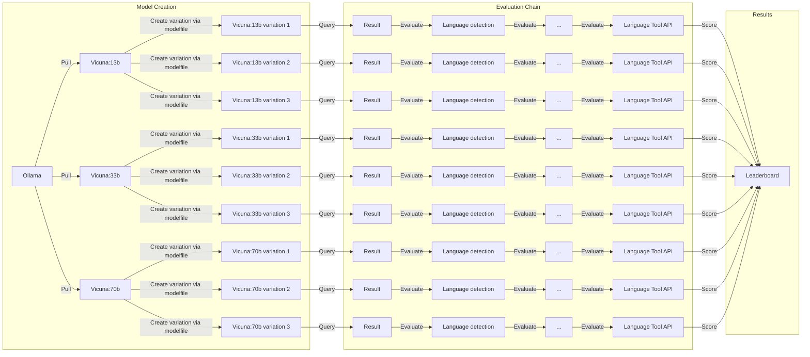

# LLM Benchmarking for Danish via Ollama

# Problem that is trying to be solved

# Description
This repository poses a design for a framework for automating and publishing benchmarking tests for off-the-shelf variations of common Free and Open Source Software (FOSS) Large Language Models (LLMs), available through [Ollama](https://ollama.ai/), specifically with the **goal of identifiying model(s) that can match or surpass GPT-4's proficiency in Danish communication** (should these exist).

The framework is not inherently designed to evaluate Danish per se, but could likewise be used to evaluate other languages, albeit this not being the focus of this repo.

The process is carried out in three overall steps:
1. **Model creation**
1. **Evaluation**
1. **Scoring**

The **Model creation** step can be extended *vertically*, as additional variations can be added parameters for variations include:
- Base model
- Variations (Tags)
- Modelfile parameters
- Pre-prompt
- RAG
- Fine-tuning

The **Evaluation** step can be extended *horizontally*, adding additional evaluation steps. Possibilities include:
- Language detection
- Bing Proof
- Bing spell-checker
- Language tool

The process can be run *ad infinitum* to increase result confidence

## To-dos
- [ ] Experiment with [Modelfiles](https://github.com/jmorganca/ollama/blob/main/docs/modelfile.md)
- [ ] Experiemnt with model variations
- [ ] Experiment with larger models like llama2:70b (Need more GPU)
- [ ] Implement RAG
- [ ] Look into spell checker api like Smodin
