# LLM Benchmarking for Danish via Ollama

```mermaid
flowchart LR
ollama --> mistral
ollama --> llama2
ollama --> vicuna
ollama --> orca-mini
ollama --> llama2-uncensored
ollama --> wizard-vicuna-uncensored
ollama --> nous-hermes
ollama --> mistral-openorca
ollama --> stable-beluga
ollama --> wizardlm-uncensored
ollama --> wizard-vicuna
ollama --> falcon
ollama --> open-orca-platypus2
ollama --> zephyr
ollama --> wizardlm
ollama --> samantha-mistral
ollama --> openhermes2-mistral
ollama --> nexusraven

mistral --> ...
llama2 --> ...
vicuna --> ...
orca-mini --> ...
llama2-uncensored --> ...
wizard-vicuna-uncensored --> ...
nous-hermes --> ...
mistral-openorca --> ...
stable-beluga --> ...
wizardlm-uncensored --> ...
wizard-vicuna --> ...
falcon --> ...
open-orca-platypus2 --> ...
zephyr --> ...
wizardlm --> ...
samantha-mistral --> ...
openhermes2-mistral --> ...
nexusraven --> ...

vicuna --> 33b
vicuna --> 7b
vicuna --> 13b
vicuna --> 7b-16k
vicuna --> 13b-16k
vicuna --> 7b-q4_0
vicuna --> 7b-q4_1
vicuna --> 7b-q5_0
vicuna --> 7b-q5_1
vicuna --> 7b-q8_0
vicuna --> 7b-q2_K
vicuna --> 7b-q3_K_S
vicuna --> 7b-q3_K_M
vicuna --> 7b-q3_K_L
vicuna --> 7b-q4_K_S
vicuna --> 7b-q4_K_M
vicuna --> 7b-q5_K_S
vicuna --> 7b-q5_K_M
vicuna --> 7b-q6_K
vicuna --> 13b-q4_0
vicuna --> 13b-q4_1
vicuna --> 13b-q5_0
vicuna --> 13b-q5_1
vicuna --> 13b-q8_0
vicuna --> 13b-q2_K
vicuna --> 13b-q3_K_S
vicuna --> 13b-q3_K_M
vicuna --> 13b-q3_K_L
vicuna --> 13b-q4_K_S
vicuna --> 13b-q4_K_M
vicuna --> 13b-q5_K_S
vicuna --> 13b-q5_K_M
vicuna --> 13b-q6_K
vicuna --> 33b-q4_0
vicuna --> 33b-q4_1
vicuna --> 33b-q5_0
vicuna --> 33b-q5_1
vicuna --> 33b-q8_0
vicuna --> 33b-q2_K
vicuna --> 33b-q3_K_S
vicuna --> 33b-q3_K_M
vicuna --> 33b-q3_K_L
vicuna --> 33b-q4_K_S
vicuna --> 33b-q4_K_M
vicuna --> 33b-q5_K_S
vicuna --> 33b-q5_K_M
vicuna --> 33b-q6_K
vicuna --> 7b-v1.5-q4_0
vicuna --> 7b-v1.5-q4_1
vicuna --> 7b-v1.5-q5_0
vicuna --> 7b-v1.5-q5_1
vicuna --> 7b-v1.5-q8_0
vicuna --> 7b-v1.5-q2_K
vicuna --> 7b-v1.5-q3_K_S
vicuna --> 7b-v1.5-q3_K_M
vicuna --> 7b-v1.5-q3_K_L
vicuna --> 7b-v1.5-q4_K_S
vicuna --> 7b-v1.5-q4_K_M
vicuna --> 7b-v1.5-q5_K_S
vicuna --> 7b-v1.5-q5_K_M
vicuna --> 7b-v1.5-q6_K
vicuna --> 13b-v1.5-q4_0
vicuna --> 13b-v1.5-q4_1
vicuna --> 13b-v1.5-q5_0
vicuna --> 13b-v1.5-q5_1
vicuna --> 13b-v1.5-q8_0
vicuna --> 13b-v1.5-q2_K
vicuna --> 13b-v1.5-q3_K_S
vicuna --> 13b-v1.5-q3_K_M
vicuna --> 13b-v1.5-q3_K_L
vicuna --> 13b-v1.5-q4_K_S
vicuna --> 13b-v1.5-q4_K_M
vicuna --> 13b-v1.5-q5_K_S
vicuna --> 13b-v1.5-q5_K_M
vicuna --> 13b-v1.5-q6_K
vicuna --> 7b-v1.5-16K-q4_0
vicuna --> 7b-v1.5-16k-q4_0
vicuna --> 7b-v1.5-16K-q4_1
vicuna --> 7b-v1.5-16k-q4_1
vicuna --> 7b-v1.5-16K-q5_0
vicuna --> 7b-v1.5-16k-q5_0
vicuna --> 7b-v1.5-16k-q5_1
vicuna --> 7b-v1.5-16K-q5_1
vicuna --> 7b-v1.5-16K-q8_0
vicuna --> 7b-v1.5-16k-q2_K
vicuna --> 7b-v1.5-16K-q2_K
vicuna --> 7b-v1.5-16k-q3_K_S
vicuna --> 7b-v1.5-16K-q3_K_S
vicuna --> 7b-v1.5-16K-q3_K_M
vicuna --> 7b-v1.5-16k-q3_K_M
vicuna --> 7b-v1.5-16k-q3_K_L
vicuna --> 7b-v1.5-16K-q3_K_L
vicuna --> 7b-v1.5-16k-q4_K_S
vicuna --> 7b-v1.5-16K-q4_K_S
vicuna --> 7b-v1.5-16K-q4_K_M
vicuna --> 7b-v1.5-16k-q4_K_M
vicuna --> 7b-v1.5-16k-q5_K_S
vicuna --> 7b-v1.5-16K-q5_K_S
vicuna --> 7b-v1.5-16k-q5_K_M
vicuna --> 7b-v1.5-16K-q5_K_M
vicuna --> 7b-v1.5-16k-q6_K
vicuna --> 7b-v1.5-16K-q6_K
vicuna --> 13b-v1.5-16k-q4_0
vicuna --> 13b-v1.5-16k-q4_1
vicuna --> 13b-v1.5-16k-q5_0
vicuna --> 13b-v1.5-16k-q5_1
vicuna --> 13b-v1.5-16k-q8_0
vicuna --> 13b-v1.5-16k-q2_K
vicuna --> 13b-v1.5-16k-q3_K_S
vicuna --> 13b-v1.5-16k-q3_K_M
vicuna --> 13b-v1.5-16k-q3_K_L
vicuna --> 13b-v1.5-16k-q4_K_S
vicuna --> 13b-v1.5-16k-q4_K_M
vicuna --> 13b-v1.5-16k-q5_K_S
vicuna --> 13b-v1.5-16k-q5_K_M
vicuna --> 13b-v1.5-16k-q6_K

```

#

- [ ] Experiment with [Modefiles](https://github.com/jmorganca/ollama/blob/main/docs/modelfile.md)
- [ ] Experiemnt with model variations
- [ ] Experiment with larger models like llama2:70b (Need more GPU)
 [ ] Implement RAG
 [ ] Look into spell checker api like Smodin
