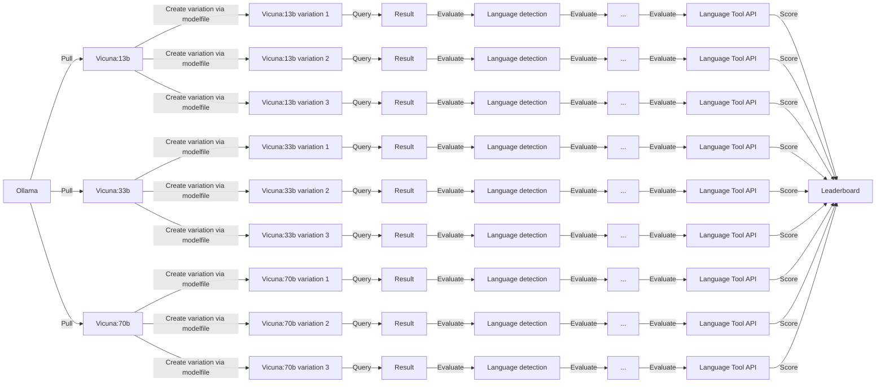

# LLM Benchmarking for Danish via Ollama

# Description
This repository aims to automate and publish benchmarking tests for off-the-shelf variations of common Free and Open Source Software (FOSS) Large Language Models (LLMs), available through Ollama. The goal is to identify a model that matches or surpasses GPT-4's proficiency in Danish communication.

This is done in the following way:

- [ ] Experiment with [Modefiles](https://github.com/jmorganca/ollama/blob/main/docs/modelfile.md)
- [ ] Experiemnt with model variations
- [ ] Experiment with larger models like llama2:70b (Need more GPU)
- [ ] Implement RAG
- [ ] Look into spell checker api like Smodin
