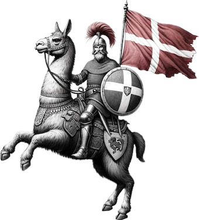

# **Status: Pre-Alpha [Not Yet Functional]**

  

# Dallama
Dallama aims to be a CLI built for testing the proficiency of communicating in Danish for various open-source large-language models.

The process is carried out in three overall steps:
1. **Model creation**
1. **Evaluation**
1. **Scoring**

The **Model creation** step can be extended *vertically*, as additional variations can be added parameters for variations include:
- Base model (e.g. *falcon:40b*)
- Variations (e.g. *falcon:40b-text-q5_0*, *40b-instruct-q4_0 etc.*)
- Modelfile parameters (e.g. *temperature*, *num_ctx*, *num_gpu* etc.)
- Pre-prompt
- RAG
- Fine-tuning

The **Evaluation** step can be extended *horizontally*, adding additional evaluation steps.

The process can be run *ad infinitum* to increase result confidence.

# TODO
- [ ] Add spell-checking capabilities using Hunspell
