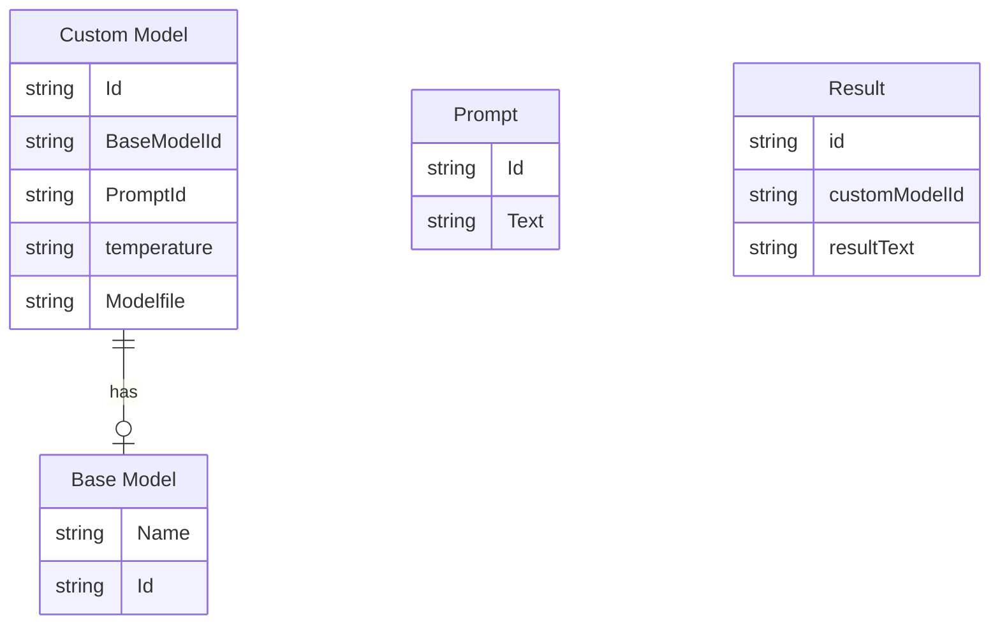

```mermaid
erDiagram

    a["Custom Model"] {
        string Id
        string BaseModelId
        string PromptId
        string temperature
        string Modelfile
    }

    b["Base Model"] {
        string Name
        string Id
    }

    c["Prompt"] {
        string Id
        string Text
    }

    d["Result"]{
        string id
        string customModelId
        string resultText
    
    }


    a ||--o| b : has

```
