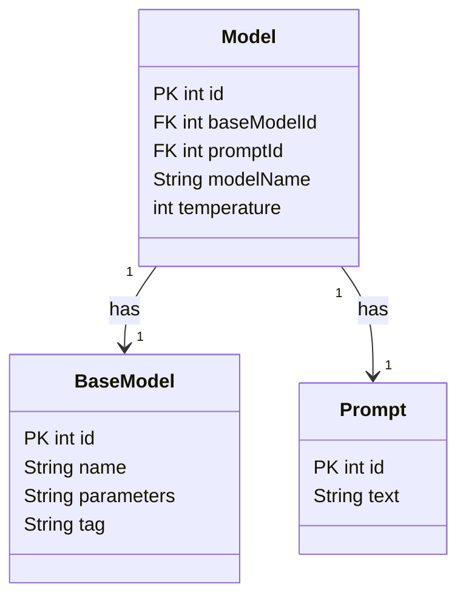

```mermaid
classDiagram
    class Model{
      PK int id
      FK int baseModelId
      FK int promptId
      String modelName
      int temperature
    }

    class BaseModel{
      PK int id
      String name
      String parameters
      String tag
    }

    class Prompt{
      PK int id
      String text
    }

    Model "1" --> "1" BaseModel: has
    Model "1" --> "1" Prompt: has
```
