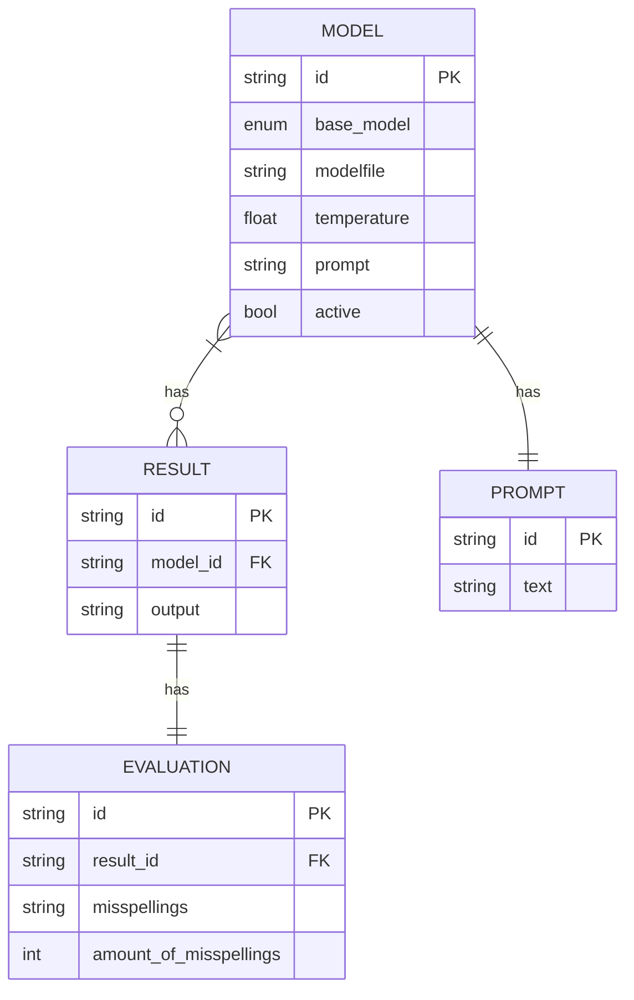

# ERD Diagram for database

```mermaid
erDiagram
    MODEL }|--o{ RESULT : has
    RESULT ||--|| EVALUATION: has
    MODEL ||--|| PROMPT: has


    MODEL {
        string id PK
        enum base_model
        string modelfile
        float temperature
        string prompt
        bool active
    }

    RESULT {
        string id PK
        string model_id FK
        string output
    }

    EVALUATION {
        string id PK
        string result_id FK
        string misspellings
        int amount_of_misspellings
    }

    PROMPT {
        string id PK
        string text
        
    }
```
